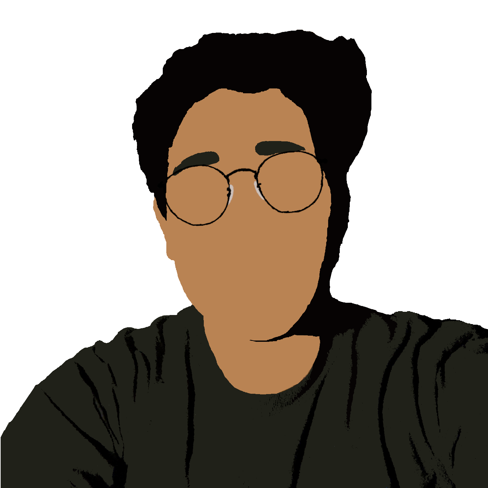

---
# Feel free to add content and custom Front Matter to this file.
# To modify the layout, see https://jekyllrb.com/docs/themes/#overriding-theme-defaults

layout: default
#layout: home
#title: Hello!
---

## About Me

I am a student and aspiring researcher currently majoring in Mechanical Engineering at the University of California, Berkeley.  

## Research

I have a wide variety of research projects ranging from image processing and its applications in compression and robotics to innovations and optimizations in additive manufacturing processes. As a student, I am always willing to try out different projects in new fields where I may not have any experience.
